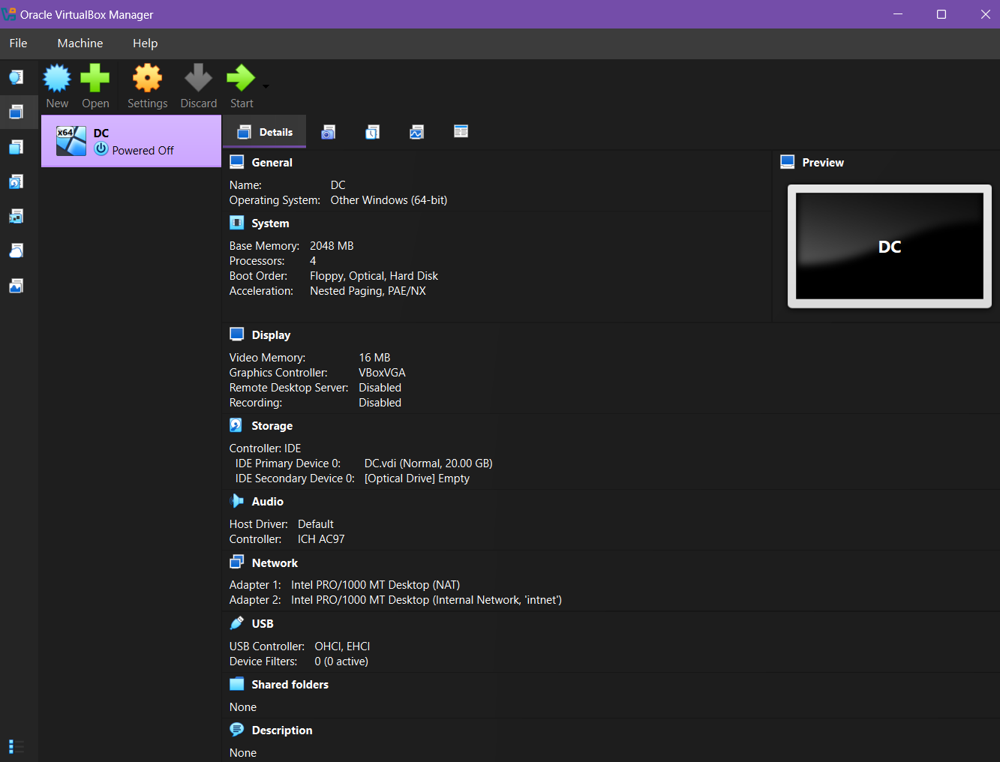
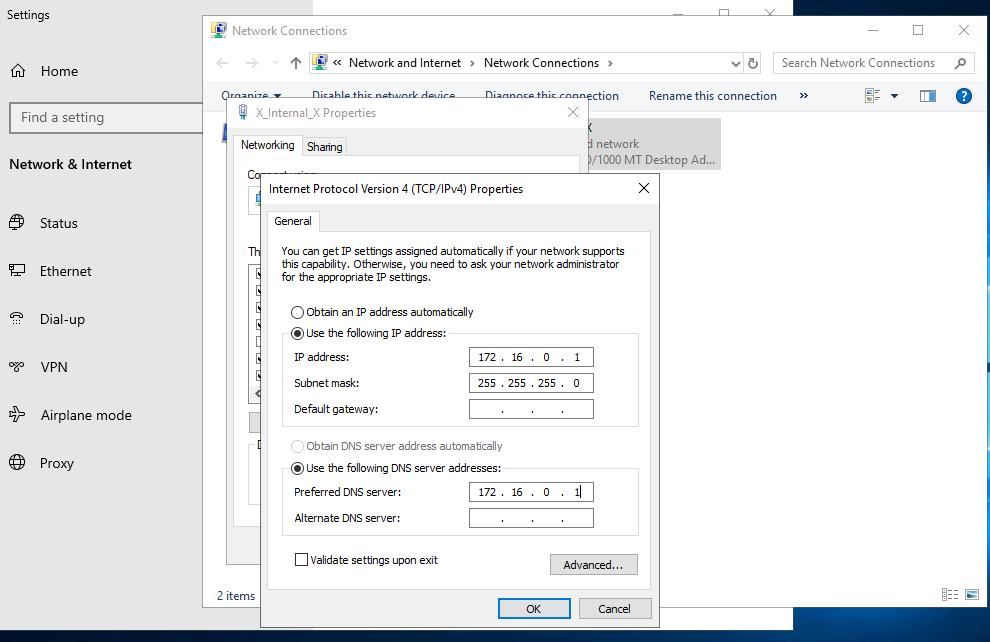
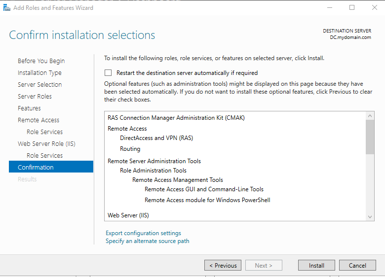
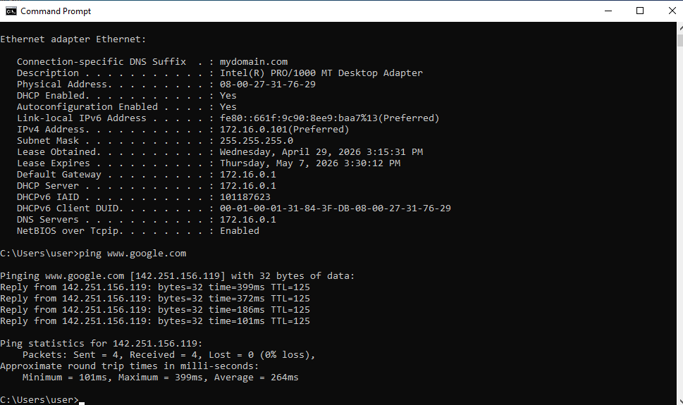
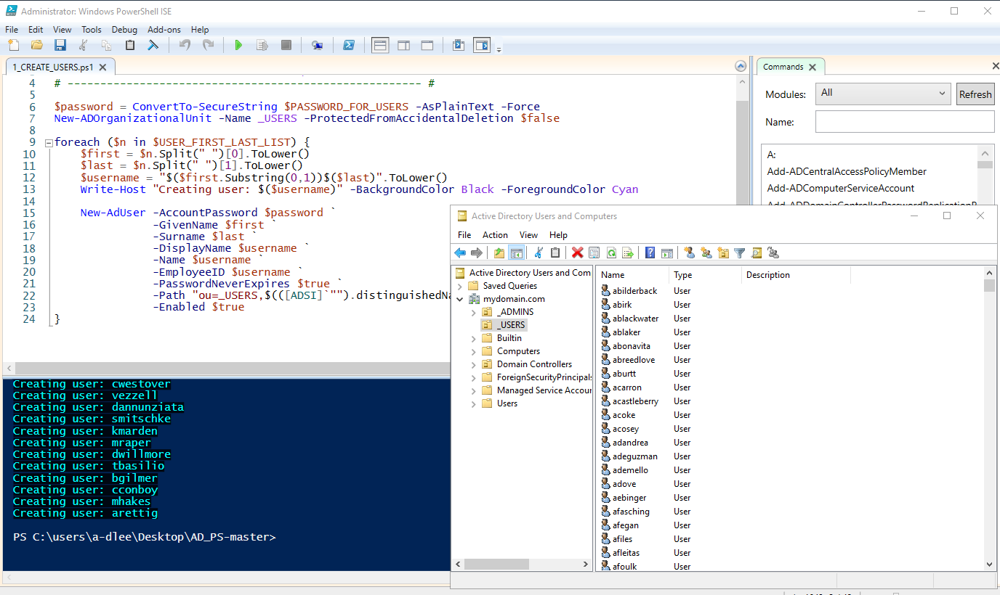

# Active Directory Home Lab (Oracle VirtualBox)

  

## Introduction
This Home Lab was built using Oracle VirtualBox to simulate a functional corporate network on Windows Server 2019. The project provided hands-on experience with Active Directory, DNS, and DHCP configuration for a Windows 10 client. A PowerShell script was also implemented to automate bulk user creation, demonstrating how automation simplifies everyday management tasks. This setup served as a practical way to gain direct experience with Windows networking and the core system administration tools used in IT support.

## Technical Skills & Tools
* Virtualization: Oracle VirutalBox
* Operating Systems: Windows Server 2019, Windows 10 Pro
* Networking: DHCP, DNS, NAT, Private Virtual Networks
* Automation: PowerShell Scripting
  
Download Links
* [Oracle VirtualBox](https://www.virtualbox.org/wiki/Downloads)
* [Windows Server 2019 ISO](https://www.microsoft.com/en-us/evalcenter/download-windows-server-2019)
* [Windows 10 ISO](https://www.microsoft.com/en-us/software-download/windows10)

---
## Project Setup

### Part 1: Virtualization & Network Setup 
The foundation of the lab is a virtualized corporate network designed to be completely isolated from the host machine.
* Environment Deployment: Used Oracle VirtualBox to host two virtual machines: a Windows Server 2019 Domain Controller and a Windows 10 client.
* Dual-NIC Configuration: The Domain Controller was configured with two network adapters—one for internet access and one for the internal private network—allowing it to act as a gateway.
* Internal Subnet: Established a private virtual network to ensure secure communication between the server and client.

  

### Part 2: Active Directory & Network Services
This stage focused on transforming the standalone server into the central management hub for the network.
* Active Directory (AD DS): Installed and configured the Active Directory role, promoting the server to a Domain Controller for the internal domain.
* Network Infrastructure: Configured Static IP addressing and DNS for proper name resolution across the private subnet.
* DHCP Management: Established a DHCP scope ($172.16.0.100 - 200$) to automate IP assignment for any client workstations joining the domain.

  

### Part 3: Routing & Internet Connectivity
To ensure the isolated client machine could reach the web safely, the server was configured as a functional router.
* NAT Configuration: Enabled Routing and Remote Access (RAS) on the server.
* Internet Gateway: Configured Network Address Translation (NAT) so the Windows 10 client could access the internet through the Domain Controller’s external adapter.
* Connectivity Verification: Confirmed the client workstation could reach external sites while remaining on the internal subnet.

  

  

### Part 4: PowerShell Automation
Instead of manual account creation, automation was used to simulate a large-scale employee onboarding process.
* Scripting: Developed a PowerShell script to read from a list of names and automatically generate unique user accounts.
* Efficiency: This process demonstrated how to provision hundreds of users instantly, ensuring consistent account settings and saving hours of manual entry.

Automation Scripts:
* [📂 Create Users Script](scripts/1_CREATE_USERS.ps1) – The primary logic for provisioning accounts in AD.
* [📂 Name Generation Script](scripts/Generate-Names-Create-Users.ps1) – Used to generate mock user data for the simulation.
  

  

---

### Project Outcome 
**The Results**

The project successfully established a functional office network within a virtual environment. The client computer integrated with the server, received an automatic IP address, and maintained stable internet connectivity. Automation was used to instantly provision over 100 user accounts, ensuring the system was organized and ready for a corporate environment.

**Key skills**
* System Administration: Hands-on experience managing a central server and user database.
* Networking: Configuring device connectivity and internal communication protocols.
* Automation: Using scripts to complete high-volume, repetitive tasks with precision.
* Troubleshooting: Diagnosing and resolving network and connectivity issues.

